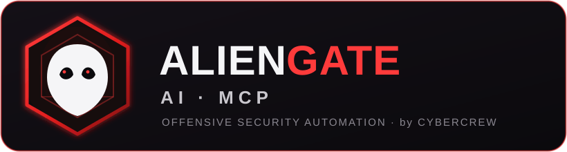

<div align="center">



# Announcing AlienGate AI MCP

### AI-Driven Offensive Security Automation — now open source

**by CyberCrew Inc.** · MIT Licensed · [github.com/cybercrewinc/aliengate-ai-mcp](https://github.com/cybercrewinc/aliengate-ai-mcp)

</div>

---

## TL;DR

**AlienGate AI MCP** turns any MCP-compatible AI assistant into a full offensive-security operator. It connects the AI to **150+ real security tools** through the Model Context Protocol, plans and runs assessments end to end, generates findings and reports, and **logs every single scan** for full auditability. It is open source under the MIT license and built for **authorized security work only**.

- **151 MCP tools · 156 API endpoints · 90+ integrated security binaries**
- Intelligent target analysis, tool selection, and attack-chain building
- Ready-made bug-bounty, CTF, and vulnerability-intelligence workflows
- Structured findings, visual vulnerability cards, and summary reports
- Complete JSON-lines audit log of every command executed

---

## What is AlienGate AI MCP?

Security testing normally means a human driving dozens of command-line tools by hand. AlienGate AI MCP removes that friction. Your AI agent calls **typed MCP tools**; the AlienGate server runs the underlying utilities on your testing host, captures the output, and returns structured results the agent can reason over — then decides the next move.

It ships as **two cooperating programs**:

| Component | File | Role |
|-----------|------|------|
| **API Server** | `aliengate_server.py` | Runs on your testing box. Exposes 150+ tools over an HTTP API, executes commands, manages processes, caches results, writes the audit log. |
| **MCP Client** | `aliengate_mcp.py` | Registers 150+ MCP tools and forwards each agent request to the server. This is what your AI client connects to. |

Works with any MCP client — **Claude Desktop, Claude Code, Cursor**, and others.

---

## What tools are we running?

AlienGate integrates **90+ security tools directly**, grouped into arsenals the AI can call on demand:

### 🔍 Network & Reconnaissance
`nmap` · `nmap-advanced` · `masscan` · `rustscan` · `arp-scan` · `nbtscan` · `autorecon` · `amass` · `subfinder` · `fierce` · `dnsenum` · `enum4linux` · `enum4linux-ng` · `responder` · `netexec` · `smbmap` · `rpcclient`

### 🌐 Web Application Security
`gobuster` · `feroxbuster` · `ffuf` · `dirb` · `dirsearch` · `wfuzz` · `nuclei` · `nikto` · `sqlmap` · `wpscan` · `arjun` · `paramspider` · `x8` · `katana` · `httpx` · `dalfox` · `xsser` · `jaeles` · `hakrawler` · `gau` · `waybackurls` · `wafw00f` · `uro` · `qsreplace` · `anew` · `zap` · `burpsuite-alternative` · `http-framework` · `browser-agent`

### 🔗 API & Auth Testing
`api_fuzzer` · `api_schema_analyzer` · `graphql_scanner` · `jwt_analyzer`

### 🔐 Passwords & Credential Attacks
`hydra` · `john` · `hashcat` · `netexec` · `hashpump`

### 🔬 Binary Analysis & Reverse Engineering
`ghidra` · `radare2` · `gdb` · `gdb-peda` · `objdump` · `strings` · `xxd` · `checksec` · `binwalk` · `ropgadget` · `ropper` · `one-gadget` · `angr` · `pwntools` · `pwninit` · `libc-database`

### 🧪 Forensics & Steganography
`volatility` · `volatility3` · `foremost` · `steghide` · `exiftool`

### ☁️ Cloud & Container Security
`prowler` · `scout-suite` · `trivy` · `clair` · `kube-hunter` · `kube-bench` · `docker-bench-security` · `checkov` · `terrascan` · `falco` · `cloudmapper` · `pacu`

### 💥 Exploitation
`metasploit` · `msfvenom` · `dotdotpwn`

> Tools are invoked only when installed on the host. Missing tools return a clear, non-fatal "not installed" message, so the agent can pick an alternative automatically.

---

## AI workflows — beyond single tools

AlienGate does not just wrap binaries. It orchestrates them into **intelligent workflows**:

- **Smart Scan & Target Intelligence** — `analyze-target`, `technology-detection`, `smart-scan`, automatic `select-tools` and `optimize-parameters`, and `create-attack-chain`.
- **Bug Bounty Automation** — reconnaissance, vulnerability-hunting, business-logic, OSINT, and file-upload testing workflows, plus a one-shot `comprehensive-assessment`.
- **CTF Toolkit** — `auto-solve-challenge`, `binary-analyzer`, `cryptography-solver`, `forensics-analyzer`, tool suggestion, and team strategy.
- **Vulnerability Intelligence** — `cve-monitor`, `threat-feeds`, `attack-chains`, `exploit-generate`, and `zero-day-research`.
- **AI Payload Engine** — context-aware payload generation and testing (`generate_payload`, `test_payload`, `advanced-payload-generation`).

---

## What do you get? Findings & reports

Every run produces structured, machine- and human-readable output:

- **Structured tool results** — normalized JSON for every scan (stdout, return code, timing, metadata).
- **Vulnerability cards** — `/api/visual/vulnerability-card` renders clean, shareable finding summaries.
- **Summary reports** — `/api/visual/summary-report` rolls an engagement's findings into a report view.
- **Attack chains** — the intelligence engine links findings into exploitation paths.
- **CVE & threat intel** — live CVE monitoring and threat-feed context attached to findings.
- **Full scan audit log** — see below.

---

## Every scan is logged

Auditability is built in. **Every scan and command runs through a single instrumented path**, so nothing executes without a record. Two logs are written next to the server:

- **`aliengate.log`** — application log (startup, tool status, recovery, errors).
- **`aliengate_scans.log`** — a structured **JSON-lines** audit trail, one line per event:
  - `tool_invocation` — a tool run was requested (tool, command, parameters)
  - `scan_start` — a command began (scan id, full command)
  - `scan_cache_hit` — a cached result was served
  - `scan_end` — a command finished (success, return code, duration, output sizes, preview)

```json
{"timestamp":"2026-09-26T20:15:04.812","event":"scan_end","scan_id":"scan_1790000000000_4821","command":"nmap -sV 10.0.0.5","success":true,"return_code":0,"duration":12.44,"stdout_bytes":3820}
```

Point the log anywhere with the `ALIENGATE_SCAN_LOG` environment variable.

---

## Resilient & fast

- **Automatic recovery** — retries with backoff, reduced-scope retries, alternative-tool fallback, and graceful degradation.
- **Process management** — async execution, a scalable worker pool, a live process dashboard, and pause/resume/terminate controls.
- **Smart caching** — repeated commands are served from cache (and still logged as cache hits).

---

## Get started in 60 seconds

```bash
git clone https://github.com/cybercrewinc/aliengate-ai-mcp.git
cd aliengate-ai-mcp
python3 -m venv aliengate_env && source aliengate_env/bin/activate
python3 -m pip install -r requirements.txt
python3 aliengate_server.py            # serves on http://127.0.0.1:8888
```

Then point your MCP client at `aliengate_mcp.py` using the included `aliengate-ai-mcp.json`. Keep `alwaysAllow` empty to require approval before autonomous runs.

> Best on a Kali/Parrot testing box, where most of the 90+ tools are already installed.

---

## Authorized use only

AlienGate AI MCP executes real offensive tooling. Use it **only** against systems you own or have **explicit, written authorization** to test. You are responsible for complying with all applicable laws, contracts, and rules of engagement. Released under the **MIT License** — see [`LICENSE`](LICENSE).

---

<div align="center">

**AlienGate AI MCP** — maintained by **CyberCrew Inc.**
[Repository](https://github.com/cybercrewinc/aliengate-ai-mcp) · [Report an issue](https://github.com/cybercrewinc/aliengate-ai-mcp/issues)

</div>
